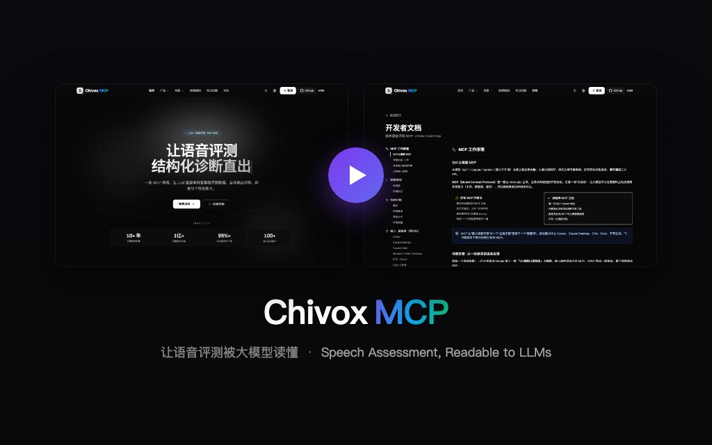
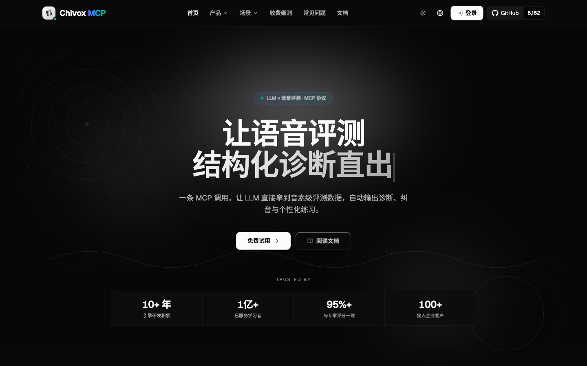
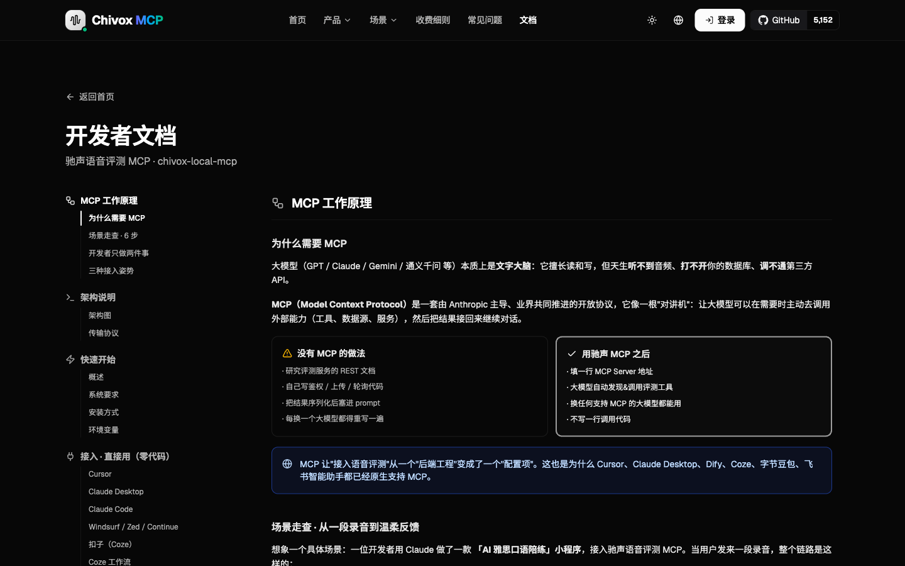
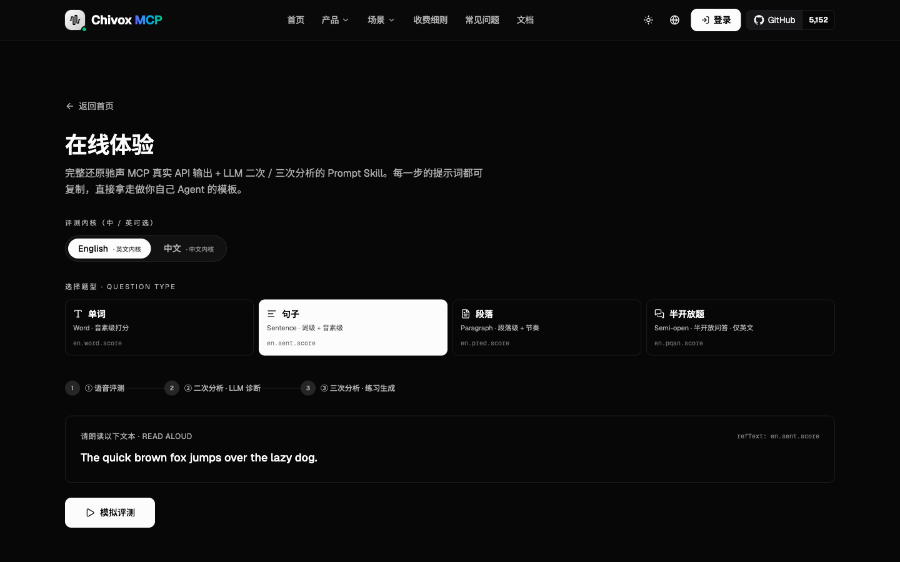
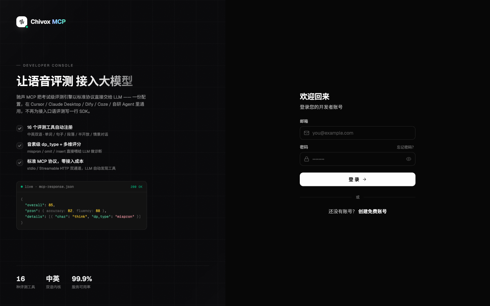
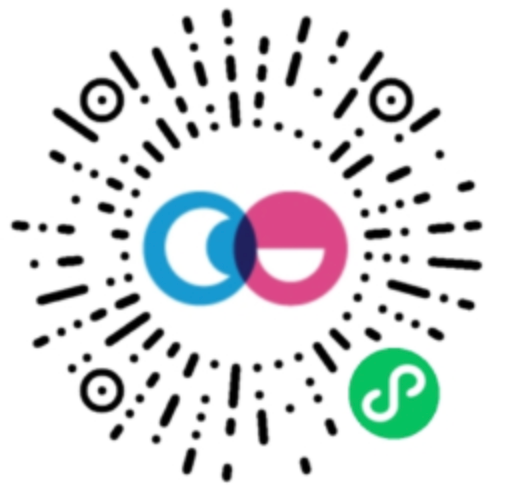

<p align="right">
  <a href="README.md">简体中文</a> · <b>English</b>
</p>

<p align="center">
  <a href="github-assets/video/index.html?play=1">
    
  </a>
</p>

<p align="center">
  <a href="https://chivoxmcp2.netlify.app">
    
  </a>
  &nbsp;&nbsp;
  <a href="https://chivoxmcp2.netlify.app/en/docs">
    
  </a>
  &nbsp;&nbsp;
  <a href="https://chivoxmcp2.netlify.app/en/demo">
    
  </a>
</p>

<h1 align="center">
  
</h1>

<p align="center">
  <strong>Make speech assessment understandable to LLMs</strong><br>
  <em>Exam-grade phoneme-level speech assessment, delivered as Model Context Protocol tools</em>
</p>

<p align="center">
  
  
  
  
  
</p>

<p align="center">
  <b>Since 2011</b> in AI speech · <b>1B+</b> global learners · <b>185 countries</b> · <b>9.2B</b> evaluations / year · <b>95%+</b> agreement with human experts
</p>

---

## 📌 What is this?

This repository is the source code of the **Chivox MCP official website** ([chivoxmcp2.netlify.app](https://chivoxmcp2.netlify.app)), built on Next.js 16 + Tailwind CSS 4 + next-intl, with bilingual support (Chinese / English).

**Chivox MCP** wraps Chivox's decade-hardened **exam-grade speech assessment engines** into a standard [Model Context Protocol](https://modelcontextprotocol.io) toolkit — with one MCP call, your LLM gets **phoneme-level** scoring data directly, auto-generating diagnosis, correction, and personalized practice. No SDK wrapping. No translation layer.

> **One MCP call. Phoneme-level results. No SDK wrapping. No translation layer.**

---

## 😩 What problems does it solve?

| What used to hurt | With Chivox MCP |
|------------------|------------------|
| LLMs **can't hear audio**; devs must integrate speech SDKs and parse features themselves | LLM calls one tool and **gets phoneme-level assessment JSON automatically** |
| Generic speech APIs return bare scores — **LLMs can't make sense of them** | Returns `overall / accuracy / dp_type / phonemes` — **natively consumable by LLMs** for direct diagnosis |
| Want Cursor / Claude / Coze / Feishu all to have speech capability — **have to wrap each platform separately** | One MCP config; **every MCP-capable client instantly gets the capability**; new tools are auto-discovered |
| Building "assess → diagnose → correct → practice" loops takes **at least a month** | Assessment / diagnosis / practice generation are all handled by MCP + LLM — **ship in days** |
| Building your own engine is costly; **accuracy / multi-language / multi-task** are hard to balance | Use the same engine on China's MoE official whitelist — **95%+ agreement with human experts** |

---

## 💡 Three core values

### ① Rich data dimensions (exam-grade granularity)

Four main dimensions (**Accuracy · Integrity · Fluency · Rhythm**) + **phoneme-level alignment** + **error typing (normal / mispron / omit / insert / wrong_tone)**, plus 20+ sub-params like stress, liaison, tones, timestamps, and audio-quality probes — **all delivered as structured JSON straight into the LLM**.

**🇬🇧 English sample** (with `stress` / `liaison` / IPA phonemes / millisecond timestamps / accent detection):

```jsonc
{
  "overall": 72,
  "pron": { "accuracy": 65, "integrity": 95, "fluency": 85, "rhythm": 70 },
  "fluency": { "overall": 85, "pause": 12, "speed": 132 },   // pauses + WPM
  "audio_quality": { "snr": 22.0, "clip": 0, "volume": 2514 }, // useful for UGC QA
  "details": [
    {
      "word": "record", "score": 58, "dp_type": "mispron",
      "start": 1100, "end": 1680,                // ms timestamps — jump-to-playback
      "stress": { "ref": 2, "score": 45 },       // wrong stress position (noun vs. verb)
      "accent": "us",                            // detected as US accent
      "phonemes": [
        { "ipa": "ɹ", "score": 45, "dp_type": "mispron" },
        { "ipa": "ɪ", "score": 78, "dp_type": "normal"  }
      ]
    },
    {
      "word": "think", "score": 62, "dp_type": "mispron",
      "start": 2400, "end": 2910,
      "liaison": "none",                         // no liaison formed
      "phonemes": [
        { "ipa": "θ", "score": 42, "dp_type": "mispron" },
        { "ipa": "ɪ", "score": 80, "dp_type": "normal"  },
        { "ipa": "ŋk", "score": 78, "dp_type": "normal" }
      ]
    }
  ]
}
```

**🇨🇳 Chinese sample** (with `tone` / tone confidence distribution / Pinyin + Hanzi dual paths):

```jsonc
{
  "overall": 82,
  "pron": { "accuracy": 80, "integrity": 100, "fluency": 86, "tone": 76 },
  "details": [
    {
      "char": "好", "pinyin": "hao3", "score": 62, "dp_type": "wrong_tone",
      "start": 820, "end": 1240,
      "tone": {
        "ref": 3, "detected": 4, "score": 40,
        "confidence": [2, 5, 10, 28, 55]         // prob over [neutral, 1st, 2nd, 3rd, 4th]
      },
      "phonemes": [
        { "ipa": "x",  "score": 92, "dp_type": "normal" },
        { "ipa": "au", "score": 70, "dp_type": "normal" }
      ]
    }
  ]
}
```

> The real engine also returns `snr / clip / volume` (audio-quality probes), `conn_type` (liaison / failed-release typing), detailed `confidence` distributions, and more. See the [Developer Docs · All Assessment Parameters](https://chivoxmcp2.netlify.app/en/docs#params) for the full field list.

### ② LLM second-pass diagnosis + third-pass practice (production loop)

Chivox ships a **Prompt Skill template** that runs the same assessment JSON through the LLM **twice**, turning cold data into warm feedback and then into executable drills.

```
    audio
      │
      ▼
┌──────────────────────────────┐
│ ① MCP assessment output      │  ← Chivox engine scores
│   structured_json            │     overall / accuracy / dp_type ...
└──────────────────────────────┘
      │
      ▼
┌──────────────────────────────┐
│ ② LLM second-pass · feedback │  ← LLM chat.completion #1
│   natural_language           │     groups by dp_type, explains, prioritizes
└──────────────────────────────┘
      │
      ▼
┌──────────────────────────────┐
│ ③ LLM third-pass · practice  │  ← LLM chat.completion #2
│   practice_loop              │     auto-generates tongue twisters / drills / plans
└──────────────────────────────┘
```

| Stage | Who does it | Output | Example |
|------|--------|----------|------|
| **① First pass** | Chivox MCP engine | `structured_json` | `{ "overall": 72, "details": [{ "char": "record", "score": 58, "dp_type": "mispron", ... }] }` |
| **② Second pass** | LLM (feedback) | `natural_language` | _"Your fluency is excellent (85)! But accuracy (65) has room to grow. You confuse /θ/ and /r/. Also note the stress shift between the noun and verb forms of 'record' and 'present'."_ |
| **③ Third pass** | LLM (drills) | `practice_loop` | _"Read 3×: 'Thirty-three thieves thought they thrilled the throne throughout Thursday.' Slow word-by-word first; tongue tip lightly against upper teeth for /θ/; curl tongue for /r/."_ 🎯 /θ/ × 6 · 🎯 /r/ × 3 · ⏱ 1.5 min |

> Try the full loop zero-setup on the [official Demo](https://chivoxmcp2.netlify.app/en/demo). The **full System Prompt template** is copy-pasteable in the [Developer Docs · Best Practices](https://chivoxmcp2.netlify.app/en/docs#prompt-templates).

Compatible with **GPT · Claude · Gemini · Doubao · DeepSeek · Qwen · GLM** and all mainstream LLMs worldwide.

### ③ Power any AI product (one line of config = capability everywhere)

```jsonc
// ~/.cursor/mcp.json —— works for any MCP-compatible client
{
  "mcpServers": {
    "chivox_voice_eval": {
      "type": "streamable-http",
      "url": "https://speech-eval.site/mcp",
      "env": { "API_KEY": "your-api-key" }
    }
  }
}
```

**Cursor · Claude Desktop · Coze · Dify · Doubao · Feishu · DingTalk · WeCom · LangChain …** — all plug and play.

---

## 🎬 From one recording to warm feedback (4-step loop)

Example: an "AI IELTS speaking coach". **The developer configures once**; every time the user speaks, assessment + feedback fire automatically.

```
   User reads 1-min intro            LLM auto-invokes Chivox
        │                              via MCP protocol
        ▼                                    │
  ┌──────────────┐  audio_url / stream  ┌─────────────────┐
  │ ① User sends │ ───────────────────► │ ② LLM calls tool│
  │   audio      │                      │   (MCP)         │
  └──────────────┘                      └────────┬────────┘
                                                 │
                     structured assessment JSON  ▼
  ┌──────────────┐  ◄──────────────────── ┌─────────────────┐
  │ ④ Personalized│                       │ ③ Chivox exam- │
  │ feedback+drill│                       │   grade engine  │
  └──────────────┘                        └─────────────────┘
```

| Step | Who | What |
|------|--------|------|
| **① Voice input** | End user | User reads the prompt text; frontend sends either a pre-recorded mp3/wav (URL / base64) **or** a real-time stream (PCM 200ms chunks) from browser / app |
| **② LLM calls MCP** | LLM | The model knows it can't hear audio but remembers the `chivox_voice_eval` tool registered at config time — auto-invokes via MCP |
| **③ Multi-dim scoring** | Chivox engine | Scores word-by-word and phoneme-by-phoneme, returns 20+ structured fields |
| **④ Teacher-style feedback** | LLM | Turns cold scores into warm, "teacher-style" personalized feedback + targeted drills, shown to the user |

👉 Try live: [chivoxmcp2.netlify.app/en/demo](https://chivoxmcp2.netlify.app/en/demo) (no signup, full loop in 30s)

---

## ⚡ Dual modes: live streaming + batch files

| | **🎙️ Real-time streaming** | **📁 Audio-file assessment** |
|--|--|--|
| **Use cases** | Interactive oral practice, AI coaching, classroom shadowing | Batch processing of existing audio, playback analysis, UGC QA |
| **Transport** | WebSocket streaming, **30–50% lower latency** | HTTP upload, three input methods |
| **Features** | Scores emerge as you speak, **no intermediate file**; auto-reconnect | Supports `audio_file_path` / `audio_base64` / `audio_url`; large files auto-compressed |
| **Formats** | PCM 16k/16-bit/mono stream | mp3 · wav · ogg · m4a · aac · pcm (6 formats) |
| **Task coverage** | Word · sentence · paragraph · semi-open (5-dim scoring) | All above + open-ended (picture description / essay) + AI Talk |

---

## 💎 Product highlights

| Dimension | Description |
|------|------|
| 🎯 **Phoneme-level diagnosis** | Per-phoneme scores, timestamps, confidence; auto-classifies `normal / omit / insert / mispron` |
| 📊 **Multi-dim scoring** | Overall · accuracy · integrity · fluency · rhythm · speed (WPM/SPM) and 20+ params |
| 📚 **Exam-grade precision** | Listed on China's MoE testing center whitelist; aligned to IELTS · TOEFL · K-12 gaokao · Mandarin proficiency test |
| 🤖 **LLM-native JSON** | GPT · Claude · Gemini · Doubao · DeepSeek · Qwen consume directly — no extra parsing |
| ⚡ **Realtime + batch** | Streaming as-you-speak OR audio-file batch — take your pick |
| 🔄 **Teaching loop** | Assess → LLM diagnose → auto-generate drills / tongue twisters / learning paths |
| 🌏 **Chinese + English engines** | Chinese-specific tones / neutral tone / erhua / tone sandhi; English phoneme-level alignment |
| 🔒 **Enterprise-grade security** | End-to-end HTTPS/TLS 1.2+, audio destroyed immediately; ISO 27001 + China MLPS L3; on-prem deploy available |

---

## 🎯 Real-world scenarios (5 use cases)

### 🎓 ① AI oral-English tutor · 24×7 coach

> _Turn Claude / GPT into your personal speaking coach_

User says "coach me for 5 minutes", the agent picks prompts → listens → scores → explains weak spots → picks the next prompt. **The conversation itself is the assessment.**

- ✅ Conversational practice, invisible scoring
- ✅ Adaptive difficulty
- ✅ Pinpoints specific phonemes / stress / pauses

### 🧒 ② Early learning · AI reading buddy

> _Give picture books, reading pens, and companion robots "ears"_

Kids read aloud to smart devices; devices call MCP; the LLM gives fun, age-appropriate corrections; parents get a learning report.

- ✅ Phonics / word / sentence assessment
- ✅ AI-generated, kid-friendly rewards
- ✅ Hardware + cloud hybrid deployment

### 💬 ③ IM collaboration · Feishu / DingTalk / WeCom

> _Move the whole teaching loop into a group chat_

Teacher @bot posts tasks; students submit via voice message; bot instantly scores and highlights errors. **Class = group, IM ID = identity.**

- ✅ No app / no H5 / no account
- ✅ Assign · submit · batch stats
- ✅ Naturally multi-tenant — class is a chat room

### 🎙️ ④ Content creation · smart QA

> _AI QA assistant for podcasts / shorts / audiobooks_

After recording a take, let AI check articulation, pacing, emotion, and pause placement — **auto-flags time ranges that need a re-take** with optimization tips.

- ✅ Pinpoints segments needing re-recording
- ✅ Multi-angle analysis: diction, rhythm, emotion
- ✅ Embed seamlessly in CapCut / Audition flows

### 🌏 ⑤ Overseas apps · foreigners learning Chinese

> _Give users abroad a real AI tutor for authentic Chinese_

Chivox's Chinese engine uniquely handles **tones / neutral tone / erhua / tone sandhi**, making overseas Chinese-speaking apps "truly hear and correct".

- ✅ Tone · erhua · sandhi fine-grained detection
- ✅ Hanzi / Pinyin dual assessment paths
- ✅ Vocabulary level aligned with HSK

---

## 🚀 Integration paths: non-tech vs developer

**Different audiences have different "fastest paths".** All paths run over the **same MCP protocol** — only the entry point differs.

### 🧑‍💼 Part A · Non-tech users (no code, 3 minutes)

> **For:** PMs, ops, curriculum designers, training leads, teachers, students — anyone who doesn't code.<br>
> **Core action:** paste a URL into your AI client / workbench and save.

#### 🅰️ Path 1: IDE / desktop AI clients (Cursor · Claude Desktop · Windsurf · Zed · Continue · Cline …)

Fastest path. Example with **Cursor**:

1. Open Cursor → `Cmd + ,` → search **MCP** → click **Add new MCP server**
2. Paste and save:

```jsonc
{
  "name": "chivox-speech-eval",
  "type": "streamable-http",
  "url": "https://speech-eval.site/mcp"
}
```

3. Restart the client, type: **"assess my English pronunciation"**, and Cursor will auto-invoke the tool.

> Claude Desktop / Windsurf / Zed / Continue / Cline use **the same config**, just in their respective `mcp.json` / `settings.json` / Cascade panels.

#### 🅱️ Path 2: Visual agent platforms (Coze · Doubao · Feishu AI Partner · DingTalk AI · WorkBuddy …)

Drag-and-drop, like installing a mobile app — no code. Example with **Coze**:

1. Open [Coze Space](https://space.coze.cn/) or the Coze bot editor
2. Click **Add Extension** → **Custom** → new MCP service
3. Fill in:

   | Field | Value |
   |--------|------|
   | Name | `chivox-speech-eval` |
   | Transport | `streamable-http` |
   | URL | `https://speech-eval.site/mcp` |

4. Save. Tell your agent "assess this pronunciation" — it invokes automatically.

> Doubao desktop, Feishu AI Partner, DingTalk AI, Qwen App, Tencent Meeting AI, WeCom assistant — all of these **enterprise / daily AI workbenches** support this same flow.

#### 🅲 Path 3: Visual workflows (Dify · n8n · Flowise · LangFlow · Coze Workflow)

For curriculum / ops teams embedding assessment into **multi-step business flows** (e.g., learner recording → assess → error book → push to CRM).

1. In Dify's "Tools" → "Custom MCP", n8n's **MCP Client** node, or Flowise's **MCP Tool** node:
2. Choose **HTTP Stream / Streamable HTTP** transport, URL `https://speech-eval.site/mcp`
3. Save. All 16 assessment tools appear in the node dropdown — **wire them up and run**.

> Benefits: traceable, replayable, batch-friendly — ideal for institutions building assessment reports and data aggregation.

👉 [Get a free API Key](https://chivoxmcp2.netlify.app/en/dashboard/keys) · [Full no-code integration docs](https://chivoxmcp2.netlify.app/en/docs#config)

---

### 👨‍💻 Part B · Developers (code integration, 10 minutes)

> **Mental model:** developers do two things only —
> **① fill in one MCP config in the backend** · **② write a System Prompt**.<br>
> Everything else (audio upload, auth, tool discovery, when to call, return format, result integration) is handled by MCP + LLM automatically.

#### 🅳 Path 4: Agent frameworks / SDKs (LangChain · Mastra · AutoGen · CrewAI · LlamaIndex · Spring AI · openai-agents …)

For developers building standalone apps with mainstream agent frameworks. Add a node to your `mcp.json`:

```jsonc
{
  "mcpServers": {
    "chivox_voice_eval": {
      "type": "streamable-http",
      "url": "https://speech-eval.site/mcp",
      "env": {
        "API_KEY": "your-api-key"
      }
    }
  }
}
```

On restart, **all 16 assessment tools auto-register** as LLM-invokable tools. New tools added by Chivox later require **zero code changes** on your side.

| Framework | Integration |
|------|----------|
| **LangChain / LlamaIndex** | `MCPToolkit` plugin |
| **Mastra** | MCP plugin config |
| **AutoGen / CrewAI** | MCP tool adapter |
| **openai-agents / mcp-use** | Native support |
| **Spring AI** (Java) | MCP starter |

#### 🅴 Path 5: Direct LLM API · Function Calling (DeepSeek · Doubao · OpenAI · Claude · Gemini · GLM · KIMI · Qwen)

For backend developers not using any agent framework, calling the LLM API directly. **Strongly recommend using an MCP client library to auto-discover tools** (new Chivox tools require no code changes):

```python
import asyncio, os, json
from openai import AsyncOpenAI
from mcp import ClientSession
from mcp.client.streamable_http import streamablehttp_client

client = AsyncOpenAI(
    base_url="https://ark.cn-beijing.volces.com/api/v3",
    api_key=os.getenv("ARK_API_KEY"),
)

async def main():
    async with streamablehttp_client(
        "https://speech-eval.site/mcp",
        headers={"Authorization": f"Bearer {os.getenv('CHIVOX_KEY')}"},
    ) as (read, write, _):
        async with ClientSession(read, write) as session:
            await session.initialize()
            mcp_tools = (await session.list_tools()).tools

            tools = [{
                "type": "function",
                "function": {
                    "name": t.name,
                    "description": t.description,
                    "parameters": t.inputSchema,
                }
            } for t in mcp_tools]

            resp = await client.chat.completions.create(
                model="ep-xxx-doubao-tools",
                messages=[
                    {"role": "system", "content": "You are an English teacher. Give warm feedback on assessment results."},
                    {"role": "user",   "content": "I read 'Apple'; audio at https://demo.com/u1.mp3"},
                ],
                tools=tools,
                tool_choice="auto",
            )

            msg = resp.choices[0].message
            if msg.tool_calls:
                call = msg.tool_calls[0]
                result = await session.call_tool(
                    call.function.name,
                    arguments=json.loads(call.function.arguments),
                )

asyncio.run(main())
```

> For even less boilerplate, use the [official MCP Python SDK](https://github.com/modelcontextprotocol/python-sdk), `mcp-use`, `openai-agents`, or Volcano's `Arkitect` — they bridge "MCP → Function Calling" for you.

👉 [Full developer docs + sample code](https://chivoxmcp2.netlify.app/en/docs#config-code)

---

### 📋 Pick the right integration at a glance

| Who / Scenario | Recommended path | Code? |
|----------------|----------|-----------|
| PMs / ops validating ideas quickly | 🅱️ Coze / Feishu AI Partner | ❌ No |
| Teachers / curriculum needing batch assessment + reports | 🅲 Dify / n8n workflow | ❌ No |
| Devs using Cursor / Claude Desktop daily | 🅰️ IDE client `mcp.json` | ❌ No |
| Building AI apps with agent frameworks | 🅳 LangChain / Mastra MCP plugin | ✅ A little |
| High-concurrency backends calling LLM APIs directly | 🅴 MCP client + Function Calling | ✅ Production |

---

## 🛠 MCP tool capabilities (16 tools)

### English assessment (10)

| Tool | Purpose |
|------|------|
| `en_word_eval` | Word pronunciation assessment (accuracy + phoneme-level) |
| `en_word_correction` | Word correction (missing / extra / mispronounced detection) |
| `en_vocab_eval` | Multi-word vocabulary list assessment |
| `en_sentence_eval` | Sentence accuracy and fluency |
| `en_sentence_correction` | Per-word error detection + correction tips |
| `en_paragraph_eval` | Paragraph reading assessment |
| `en_phonics_eval` | Phonics rules mastery |
| `en_choice_eval` | Spoken multiple-choice (preset options) |
| `en_semi_open_eval` | Semi-open dialog / scenario speaking |
| `en_realtime_eval` | Real-time sentence-by-sentence feedback |

### Chinese assessment (6)

| Tool | Purpose |
|------|------|
| `cn_word_raw_eval` | Hanzi pronunciation assessment |
| `cn_word_pinyin_eval` | Pinyin pronunciation |
| `cn_sentence_eval` | Word / sentence reading |
| `cn_paragraph_eval` | Paragraph reading |
| `cn_rec_eval` | Bounded-branch recognition (preset options) |
| `cn_aitalk_eval` | Chinese conversational ability |

> Audio input supports three methods: `audio_file_path` · `audio_base64` · `audio_url`

---

## 💳 Pricing & plans

Tiered billing by **call volume + concurrency** — **the more you use, the lower the per-call price**. Free trial credits on signup.

| Plan | For | Includes |
|------|----------|------|
| **Starter** (free) | Prototyping · personal use | Standard MCP protocol access |
| **Standard** | Commercial production | Chinese + English assessment |
| **Growth** | Growth stage · first discount tier | Streaming + file modes |
| **Scale** | High concurrency · bigger discount | 8 main dims + phoneme sub-dims |
| **Enterprise** | On-prem deploy · custom SLA · 7×24 support | Full capability + data residency |

→ [See plan details](https://chivoxmcp2.netlify.app/en/dashboard/plans) · [Contact sales for a quote](mailto:sales@chivox.com)

---

## ❓ FAQ

<details>
<summary><b>Q1 · What is MCP (Model Context Protocol)?</b></summary>

MCP is a standardized protocol for exposing external tools and data sources to LLMs in a uniform format. Chivox MCP uses this protocol to deliver structured speech-assessment data to LLMs for consumption.
</details>

<details>
<summary><b>Q2 · How does Chivox MCP work?</b></summary>

The user sends audio via the client; the Chivox MCP server completes the assessment and returns structured data (overall, accuracy, fluency, and more). The LLM consumes this data directly to generate teaching feedback.
</details>

<details>
<summary><b>Q3 · Which languages are supported?</b></summary>

Currently **Mandarin Chinese** and **English** assessment. Chinese uniquely handles tones / neutral tone / erhua / tone sandhi. More languages are being added.
</details>

<details>
<summary><b>Q4 · How is MCP different from a regular speech assessment API?</b></summary>

Regular APIs return raw scores — developers must interpret and present them. MCP delivers data in an LLM-consumable format, so the model can do second-pass analysis and generate teaching content directly, **drastically cutting development cost**.
</details>

<details>
<summary><b>Q5 · How is data security ensured?</b></summary>

End-to-end HTTPS / TLS 1.2+ encryption; audio is destroyed immediately after assessment. Chivox is certified to **ISO 27001** and China's **MLPS Level 3**. Enterprise plans support on-prem deployment and data residency.
</details>

<details>
<summary><b>Q6 · Does it support real-time assessment?</b></summary>

Yes. MCP provides a streaming assessment capability that returns interim results as the user speaks, **30–50% lower latency**, ideal for interactive oral practice.
</details>

<details>
<summary><b>Q7 · Do failed requests count against my quota?</b></summary>

No. **Billing is per successful assessment**; failed requests are not counted. You can purchase concurrency packs separately to smooth out traffic peaks.
</details>

---

## 📸 Screenshots

<table>
  <tr>
    <td align="center"><b>Home</b><br></td>
    <td align="center"><b>Developer Docs</b><br></td>
  </tr>
  <tr>
    <td align="center"><b>Live Demo</b><br></td>
    <td align="center"><b>Plans</b><br></td>
  </tr>
</table>

---

## 🧩 About this website (developer info)

This repo is the **official website code** for the product above — not the MCP server itself. Built with:

- **Framework**: Next.js 16 (App Router) + React 19
- **Styling**: Tailwind CSS 4 + shadcn/ui + framer-motion
- **i18n**: next-intl (Chinese / English)
- **Deployment**: Netlify (site: `chivoxmcp2`)

### Local development

```bash
npm install
npm run dev
```

Open <http://localhost:3000>.

### Production deployment

```bash
netlify deploy --prod --build
```

> For deployment details, branching strategy, and version tagging, see `AGENTS.md` in the repo.

---

## 💬 Support & community

<table>
  <tr>
    <td width="50%" valign="top">

**🐛 Bugs / feature requests**<br>
[GitHub Issues](https://github.com/chivox/chivox-mcp/issues) — please search for duplicates first

**📖 Full documentation**<br>
[chivoxmcp2.netlify.app/en/docs](https://chivoxmcp2.netlify.app/en/docs)

**🚀 Live demo**<br>
[chivoxmcp2.netlify.app/en/demo](https://chivoxmcp2.netlify.app/en/demo) (no signup)

**📝 Releases**<br>
[GitHub Releases](https://github.com/chivox/chivox-mcp/releases)

**💼 Sales / partnerships**<br>
<sales@chivox.com>

</td>
    <td width="50%" valign="top" align="center">

**WeChat scan · try the mini-program demo**<br>
<br>
<sub>Learn more about Chivox and try the mini-program</sub>

</td>
  </tr>
</table>

### 🔗 Related projects

- [Model Context Protocol](https://modelcontextprotocol.io) — MCP official site
- [MCP Python SDK](https://github.com/modelcontextprotocol/python-sdk) · [TypeScript SDK](https://github.com/modelcontextprotocol/typescript-sdk)
- [Awesome MCP Servers](https://github.com/punkpeye/awesome-mcp-servers) — MCP ecosystem index

### ⭐ Star history

[](https://star-history.com/#chivox/chivox-mcp&Date)

### 🤝 Contributing

Issues and PRs welcome. For major features, please open an issue first to discuss the design; small doc / example improvements can go straight to PR.

---

<div align="center">

Made by <b>Chivox</b> · Apache-2.0 License<br>
<a href="https://chivoxmcp2.netlify.app"><b>chivoxmcp2.netlify.app</b></a> · v1.0.0<br><br>
<sub>© 2026 Suzhou Chivox Information Technology Co., Ltd. · All rights reserved</sub>

</div>
