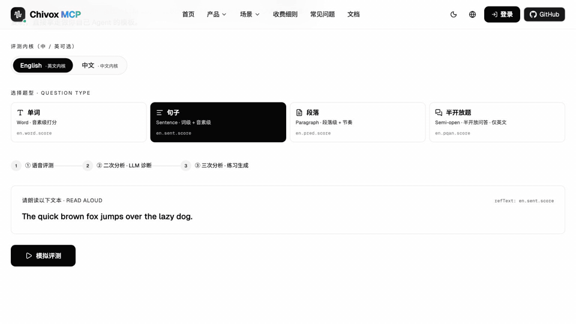
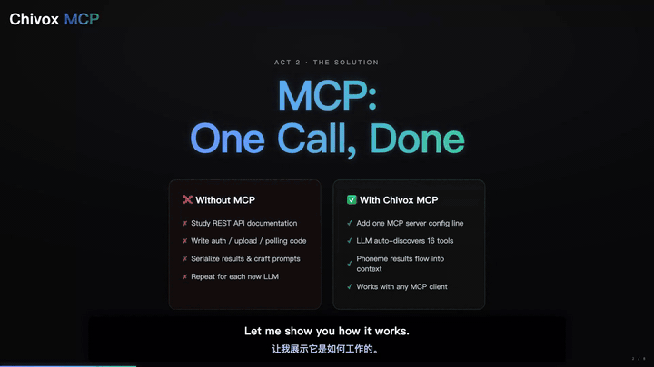
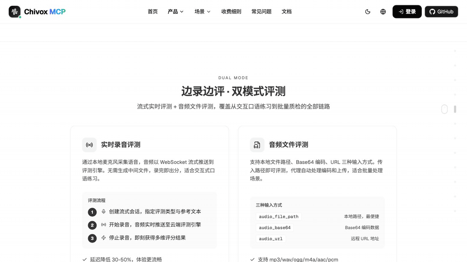
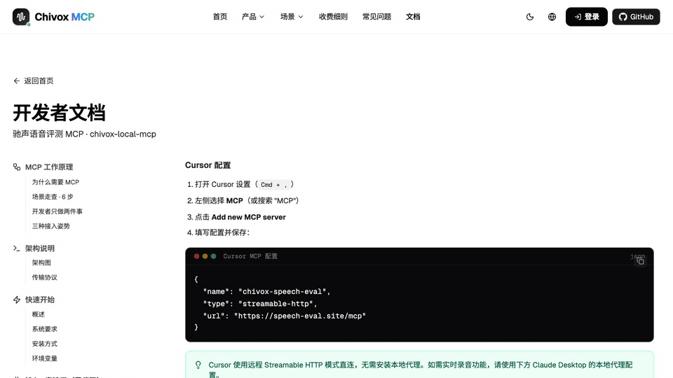
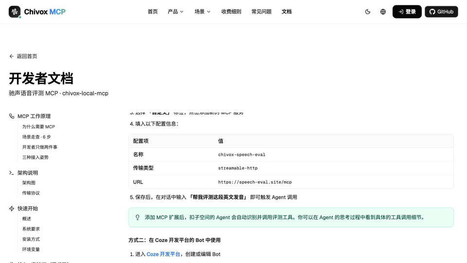
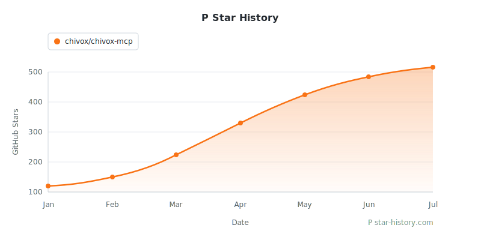

<p align="right">
  <b>简体中文</b> · <a href="README.en.md">English</a>
</p>

<p align="center">
  <a href="https://18ks.chivoxapp.com/doc/chivox-mcp-demo.mp4">
    
  </a>
</p>

<p align="center">
  <a href="https://chivoxmcp2.netlify.app">
    
  </a>
  &nbsp;&nbsp;
  <a href="https://chivoxmcp2.netlify.app/zh/docs">
    
  </a>
  &nbsp;&nbsp;
  <a href="https://chivoxmcp2.netlify.app/zh/demo">
    
  </a>
</p>

<h1 align="center">
  
</h1>

<p align="center">
  <strong>让语音评测被大模型读懂</strong><br>
  <em>Exam-grade phoneme-level speech assessment, delivered as Model Context Protocol tools</em>
</p>

<p align="center">
  
  
  
  
  
</p>

<p align="center">
  <b>自 2011 年</b> 深耕 AI 语音 · <b>10 亿+</b> 全球学习者 · <b>185 国</b> 覆盖 · <b>92 亿次/年</b> 评测量 · <b>95%+</b> 与专家评分一致
</p>

---

## 📌 这是什么？

本仓库是 **驰声 Chivox MCP 官方网站**（[chivoxmcp2.netlify.app](https://chivoxmcp2.netlify.app)）的源代码，基于 Next.js 16 + Tailwind CSS 4 + next-intl 构建，支持中英双语。

**Chivox MCP** 把驰声深耕十余年的 **考试级语音评测引擎**，封装为标准 [Model Context Protocol](https://modelcontextprotocol.io) 工具集——一条 MCP 调用，LLM 就能直接拿到 **音素级** 评测数据，自动输出诊断、纠音与个性化练习，无需 SDK 封装、无需翻译层。

> **One MCP call. Phoneme-level results. No SDK wrapping. No translation layer.**

---

## 😩 它解决了什么问题？

| 你以前面对的麻烦 | 用 Chivox MCP 后 |
|------------------|------------------|
| 大模型 **听不到音频**，开发者要自己接语音 SDK、做特征解析 | LLM 直接调一次工具，**自动拿到音素级评测 JSON** |
| 普通语音评测 API 只返回干巴巴的分数，**LLM 看不懂** | 输出的字段（`overall / accuracy / dp_type / phonemes`）**LLM 原生可消费**，直接写诊断 |
| 想让 Cursor / Claude / 扣子 / 飞书…… 都拥有评测能力，要 **每个平台单独封装** | 一条 MCP 配置，**所有支持 MCP 的客户端瞬间获得能力**，新增工具自动发现 |
| 教育产品要做 "评测 → 诊断 → 纠音 → 练习" 闭环，**至少要 1 个月开发** | 评测 / 诊断 / 练习生成全部由 MCP + LLM 自动完成，**几天就能上线** |
| 评测引擎自研代价大，**精度 / 多语种 / 多题型** 难兼顾 | 沿用驰声进入 **教育部考试中心白名单** 的同款引擎，**95%+ 与专家评分一致** |
| **普通开发者 / 独立开发者** 想做语音产品，却得先啃 DSP、ASR、语音模型训练 | **零语音背景也能上手**——你只写 prompt 和 UI，音素评测这一层交给 MCP |
| 想验证"语音 + AI" 的 idea，却被 **自建音频管线 / 模型部署 / GPU 成本** 劝退 | 一行 MCP 配置、注册就有 **免费额度**，一个人、一个周末就能跑通 PoC |
| side project 刚起步，**付费调用量不稳定**，不想一上来就签年框 | **按量计费 + 免费试用** 友好给个人开发者，冷启动阶段几乎零成本 |

> 🎮 **先别急着看文档**——官网 [**在线体验 Demo · /zh/demo**](https://chivoxmcp2.netlify.app/zh/demo) 已经把「MCP 打分 → LLM 诊断 → 练习生成」三段式闭环跑通，**无需注册、30 秒看完整链路**。下面所有描述都可以在这一页里亲手点一遍。

---

## 💡 三大核心价值

### ① 丰富的数据维度（考试级颗粒度）

四大主维度（**Accuracy · Integrity · Fluency · Rhythm**）+ **音素级对齐** + **错误类型分类（normal / mispron / omit / insert / wrong_tone）**，外加重音、连读、声调、时间戳、音质探针等 20+ 子参数，**全部以结构化 JSON 直送 LLM**。

**🇬🇧 英文示例**（含重音 `stress` / 连读 `liaison` / 音素 IPA / 毫秒级时间戳 / 英美音识别）：

```jsonc
{
  "overall": 72,
  "pron": { "accuracy": 65, "integrity": 95, "fluency": 85, "rhythm": 70 },
  "fluency": { "overall": 85, "pause": 12, "speed": 132 },   // 停顿次数 + WPM
  "audio_quality": { "snr": 22.0, "clip": 0, "volume": 2514 }, // UGC 质检可用
  "details": [
    {
      "word": "record", "score": 58, "dp_type": "mispron",
      "start": 1100, "end": 1680,                // 毫秒时间戳，可直接回放定位
      "stress": { "ref": 2, "score": 45 },       // 重音错位（名→动词重音判断）
      "accent": "us",                            // 识别到美音发音倾向
      "phonemes": [
        { "ipa": "ɹ", "score": 45, "dp_type": "mispron" },
        { "ipa": "ɪ", "score": 78, "dp_type": "normal"  }
      ]
    },
    {
      "word": "think", "score": 62, "dp_type": "mispron",
      "start": 2400, "end": 2910,
      "liaison": "none",                         // 未形成连读
      "phonemes": [
        { "ipa": "θ", "score": 42, "dp_type": "mispron" },
        { "ipa": "ɪ", "score": 80, "dp_type": "normal"  },
        { "ipa": "ŋk", "score": 78, "dp_type": "normal" }
      ]
    }
  ]
}
```

**🇨🇳 中文示例**（含声调 `tone` / 声调置信度分布 / 拼音 + 汉字双路径）：

```jsonc
{
  "overall": 82,
  "pron": { "accuracy": 80, "integrity": 100, "fluency": 86, "tone": 76 },
  "details": [
    {
      "char": "好", "pinyin": "hao3", "score": 62, "dp_type": "wrong_tone",
      "start": 820, "end": 1240,
      "tone": {
        "ref": 3, "detected": 4, "score": 40,
        "confidence": [2, 5, 10, 28, 55]         // [轻声, 1声, 2声, 3声, 4声] 概率分布
      },
      "phonemes": [
        { "ipa": "x",  "score": 92, "dp_type": "normal" },
        { "ipa": "au", "score": 70, "dp_type": "normal" }
      ]
    }
  ]
}
```

> 真实引擎还会返回 `snr / clip / volume`（录音质量探针）、`conn_type`（失爆 / 连读类型）、`confidence` 分布等更多字段，完整字段见 [开发者文档 · 全部评测参数](https://chivoxmcp2.netlify.app/zh/docs#params)。

### ② LLM 二次诊断 + 三次练习生成（生产级闭环）

驰声配套的 **Prompt Skill 模板**，把同一份评测 JSON 在大模型里 **跑两遍**，输出从冷数据到温暖反馈、再到可执行练习的完整链路。

<p align="center">
  
  <br><sub>🎞️ JSON → 自然语言反馈 → 个性化练习，三段链路实时流动</sub>
</p>

```
   一段录音
       │
       ▼
┌──────────────────────────────┐
│ ① MCP 评测输出（一次分析）   │  ← 驰声引擎打分
│   structured_json            │     overall / accuracy / dp_type ...
└──────────────────────────────┘
       │
       ▼
┌──────────────────────────────┐
│ ② LLM 二次分析 · 教学反馈    │  ← LLM 第 1 趟 chat.completion
│   natural_language           │     按 dp_type 归类、解释原因、排优先级
└──────────────────────────────┘
       │
       ▼
┌──────────────────────────────┐
│ ③ LLM 三次分析 · 练习生成    │  ← LLM 第 2 趟 chat.completion
│   practice_loop              │     自动出绕口令 / 跟读素材 / 学习计划
└──────────────────────────────┘
```

| 阶段 | 谁在做 | 输出形态 | 示例 |
|------|--------|----------|------|
| **① 一次分析** | 驰声 MCP 引擎 | `structured_json` | `{ "overall": 72, "details": [{ "char": "record", "score": 58, "dp_type": "mispron", ... }] }` |
| **② 二次分析** | 大模型（教学反馈） | `natural_language` | _「你的流利度优秀（85）！但准确度（65）有提升空间。你在 /θ/ 和 /r/ 两个音素上存在混淆，记得 record 和 present 的重音位置需要区分名词和动词用法。」_ |
| **③ 三次分析** | 大模型（练习闭环） | `practice_loop` | _「跟读 3 遍：『Thirty-three thieves thought they thrilled the throne throughout Thursday.』先分词慢读，舌尖轻抵上齿发清辅音 /θ/，/r/ 用卷舌近音。」🎯 /θ/ × 6 · 🎯 /r/ × 3 · ⏱ 1.5 分钟_ |

> 整套链路在官网 [Demo](https://chivoxmcp2.netlify.app/zh/demo) 可零门槛体验。**System Prompt 完整模板** 可在 [开发者文档 · 最佳实践](https://chivoxmcp2.netlify.app/zh/docs#prompt-templates) 中复制。

兼容 **GPT · Claude · Gemini · 豆包 · DeepSeek · 通义千问 · GLM** 等国内外主流大模型。

### ③ 赋能全场景 AI 产品（一行配置 = 所有平台获得能力）

```jsonc
// ~/.cursor/mcp.json —— 所有支持 MCP 的客户端通用
{
  "mcpServers": {
    "chivox_voice_eval": {
      "type": "streamable-http",
      "url": "https://speech-eval.site/mcp",
      "env": { "API_KEY": "你的专属密钥" }
    }
  }
}
```

**Cursor · Claude Desktop · 扣子 Coze · Dify · 豆包 · 飞书 · 钉钉 · 企业微信 · LangChain ……** 全部即插即用。

---

## 🎬 一段录音如何变成温柔反馈（4 步闭环）

以"AI 雅思口语陪练"为例。**开发者只需配置一次**,用户每次说话都自动评测 + 反馈。

<p align="center">
  
  <br><sub>🎞️ 用户说话 → LLM 调用 MCP → 引擎评分 → 温柔反馈,全程 &lt; 3 秒</sub>
</p>

```
   用户朗读 1 分钟自我介绍                LLM 自动按 MCP 协议
        │                                  调用驰声评测
        ▼                                       │
  ┌──────────────┐    audio_url / stream    ┌─────────────────┐
  │  ① 用户发来  │ ──────────────────────► │  ② LLM 调用工具  │
  │   一段录音    │                         │  (MCP)          │
  └──────────────┘                         └────────┬────────┘
                                                    │
                       结构化评测 JSON              ▼
  ┌──────────────┐  ◄──────────────────── ┌─────────────────┐
  │ ④ 个性化反馈 │                        │ ③ 驰声考试级    │
  │  + 纠音练习   │                        │   引擎打分      │
  └──────────────┘                         └─────────────────┘
```

| 步骤 | 谁在做 | 内容 |
|------|--------|------|
| **① 语音输入** | 终端用户 | 用户朗读指定文本，前端二选一：已录好的 mp3/wav（URL / base64）**或** 浏览器/小程序/App 的**实时流式录音**（PCM 200ms 分片） |
| **② LLM 调用 MCP** | 大模型 | LLM 意识到自己听不到音频，但记得配置阶段注册过 `chivox_voice_eval` 工具，自动按 MCP 协议发起调用 |
| **③ 多维评测** | 驰声引擎 | 评测引擎逐词、逐音素打分，返回 20+ 维结构化 JSON |
| **④ 教学反馈** | 大模型 | LLM 把冷冰冰的分数翻译成"老师式"个性化反馈 + 针对性练习，直接展示给用户 |

👉 在线感受：[chivoxmcp2.netlify.app/zh/demo](https://chivoxmcp2.netlify.app/zh/demo)（无需注册，30 秒看完整闭环）

---

## ⚡ 双模式评测：边录边评 + 文件批量

<p align="center">
  <br>
  <sub>🎞️ 左:实时流式边读边反馈(&lt; 300ms) · 右:文件批量处理(WAV/MP3/…)</sub>
</p>

| | **🎙️ 实时录音评测** | **📁 音频文件评测** |
|--|--|--|
| **适用** | 交互式口语练习、AI 陪练、课堂跟读 | 已有音频的批量处理、回放分析、UGC 质检 |
| **传输** | WebSocket 流式推送,**延迟降低 30-50%** | HTTP 上传,三种输入方式 |
| **特性** | 录完即出分,**无需中间文件**;断线自动重连 | 支持 `audio_file_path` / `audio_base64` / `audio_url`;大文件自动压缩 |
| **格式** | PCM 16k/16bit/mono 流 | mp3 · wav · ogg · m4a · aac · pcm(6 种) |
| **题型覆盖** | 单词 · 句子 · 段落 · 半开放(5 维评分) | 同上 + 开放题(看图说话 / 作文)+ AI Talk 人机对话 |

---

## 💎 产品亮点一览

| 维度 | 说明 |
|------|------|
| 🎯 **音素级诊断** | 逐音素打分、时间戳、置信度，自动识别 `normal / omit / insert / mispron` 四类错误 |
| 📊 **多维度评分** | 总分 · 准确度 · 完整度 · 流利度 · 韵律度 · 语速（WPM/SPM）等 20+ 参数 |
| 📚 **考试级精度** | 入选教育部考试中心白名单，对齐雅思 · TOEFL · K12 中高考 · 普通话水平测试 |
| 🤖 **LLM 原生 JSON** | GPT · Claude · Gemini · 豆包 · DeepSeek · 通义千问 直接消费，无需再解析 |
| ⚡ **实时 + 批量** | 流式边读边反馈 + 音频文件批量处理两种模式可选 |
| 🔄 **教学闭环** | 评测 → LLM 诊断 → 自动生成纠音练习 / 绕口令 / 学习路径 |
| 🌏 **中英双引擎** | 中文独有声调 / 轻声 / 儿化 / 变调精细识别；英文音素级对齐 |
| 🔒 **企业级安全** | 全链路 HTTPS/TLS 1.2+，音频即时销毁；ISO 27001 + 等保三级，支持私有化部署 |

---

## 🎯 典型落地场景（5 个真实案例）

### 🎓 ① AI 口语私教 · 24h 陪练

> _让 Claude / GPT 变成你的私人口语教练_

用户一句"陪我练 5 分钟口语"，Agent 自动出题 → 听录音 → 评分 → 解释弱项 → 再出一题，**对话本身就是评测**。

- ✅ 对话式练习，无感评测
- ✅ 个性化难度自适应
- ✅ 定位具体音素 / 重音 / 停顿

### 🧒 ② 儿童启蒙 · AI 伴读

> _给绘本、点读笔、陪伴机器人装上"耳朵"_

孩子对着智能硬件朗读，设备通过 MCP 调用评测引擎，LLM 实时给出趣味化纠音，家长同步拿到学情报告。

- ✅ 自然拼读 / 单词 / 句子评测
- ✅ AI 生成儿童向奖励反馈
- ✅ 支持硬件 + 云端混合部署

### 💬 ③ IM 协同 · 飞书 / 钉钉 / 企微

> _把整个教学闭环搬进一条群聊_

老师 @机器人发布任务，学生长按一条语音就提交，机器人秒出评分 + 错音高亮。**班级 = 群，IM 账号即身份。**

- ✅ 免 App / 免 H5 / 免账号
- ✅ 作业下发 · 提交 · 批量统计
- ✅ 天然多租户，班级即聊天室

### 🎙️ ④ 内容创作 · 智能质检

> _播客 / 短视频 / 有声书的 AI 质检助理_

创作者录完一段，让 AI 检查吐字清晰度、语速、情感、停顿位置，**自动标出需重录的时间点**并给出优化建议。

- ✅ 精准定位需重录片段
- ✅ 吐字 / 节奏 / 情感多维分析
- ✅ 无缝嵌入剪映 / Audition 流程

### 🌏 ⑤ 出海 App · 老外学中文

> _让海外用户跟 AI 老师练一口地道中文_

驰声中文引擎独有的**声调 / 轻声 / 儿化 / 变调精细检测**，让海外 App 里的中文口语教学真正"能听懂 · 能纠音"。

- ✅ 声调 · 儿化 · 变调精细识别
- ✅ 汉字 / 拼音双路径评测
- ✅ 词汇量等级与 HSK 对齐

---

## 🚀 接入方式：普通人 vs 开发者

**不同人群有不同的"最快路径"。** 无论哪条路，底层走的是**完全相同的 MCP 协议**，能力等价——只是入口不同。

### 🧑‍💼 Part A · 普通人 / 非技术用户（零代码，3 分钟）

> **适合：** 产品经理、运营、教研、培训主管、老师、学生……任何不写代码的人。<br>
> **核心动作：** 在常用的 AI 客户端 / 工作台里"填一段 URL"，保存即用。

#### 🅰️ 方式一：IDE / 桌面 AI 客户端（Cursor · Claude Desktop · Windsurf · Zed · Continue · Cline …）

最快的方式。以 **Cursor** 为例：

1. 打开 Cursor → `Cmd + ,` → 搜索 **MCP** → 点 **Add new MCP server**
2. 粘贴下面这段 JSON、保存：

```jsonc
{
  "name": "chivox-speech-eval",
  "type": "streamable-http",
  "url": "https://speech-eval.site/mcp"
}
```

3. 重启客户端,在聊天框里说一句:**「帮我评测这段英文发音」**,Cursor 会自动调用工具输出诊断。

<p align="center">
  
  <br><sub>🎞️ 打开设置 → 粘贴 JSON → 对话即自动调用评测工具</sub>
</p>

> Claude Desktop / Windsurf / Zed / Continue / Cline 等客户端**用同一段配置**,只是入口分别在各自的 `mcp.json` / `settings.json` / Cascade 面板里。

#### 🅱️ 方式二：可视化 Agent 平台（扣子 Coze · 豆包 · 飞书智能伙伴 · 钉钉 AI 助理 · WorkBuddy …）

像安装手机 App 一样拖拽配置，不用写任何代码。以 **扣子（Coze）** 为例：

1. 打开 [扣子空间](https://space.coze.cn/) 或 Coze 开发平台的 Bot 编辑页
2. 在对话框下方点 **「添加扩展」** → **「自定义」** → 新建 MCP 服务
3. 填入：

   | 配置项 | 值 |
   |--------|------|
   | 名称 | `chivox-speech-eval` |
   | 传输类型 | `streamable-http` |
   | URL | `https://speech-eval.site/mcp` |

4. 保存；对 Agent 说「帮我评测这段发音」即可自动调用。

<p align="center">
  
  <br><sub>🎞️ 添加扩展 → 填 URL → 对话自动出分，全程零代码</sub>
</p>

> 豆包桌面版、飞书智能伙伴、钉钉 AI 助理、通义千问 App、腾讯会议 AI、企业微信智能助手 …… 所有这类**企业 / 日常 AI 工作台**都支持这个流程，入口分别在各自的「智能体扩展 / 插件 / AI 工具箱」。

#### 🅲 方式三：可视化工作流（Dify · n8n · Flowise · LangFlow · Coze 工作流）

适合想把评测编排进 **多步业务流** 的教研 / 运营团队（例：学员录音 → 评测 → 错题集 → 推送到 CRM）。

1. 在 Dify「工具」→「自定义 MCP」、n8n 的 **MCP Client** 节点、Flowise 的 **MCP Tool** 节点中
2. Transport 选 **HTTP Stream / Streamable HTTP**，URL 填 `https://speech-eval.site/mcp`
3. 保存后，16 个评测工具会以下拉选项自动出现在节点里，**拖线连上就能跑**

> 优势：流程可追溯、可回放、支持批量；适合机构做考评报表与数据归集。

👉 [免费获取 API Key](https://chivoxmcp2.netlify.app/zh/dashboard/keys) · [完整零代码接入文档](https://chivoxmcp2.netlify.app/zh/docs#config)

---

### 👨‍💻 Part B · 开发者（代码接入，10 分钟上线）

> **核心心智模型：** 开发者只做两件事 ——
> **① 在后端填一次 MCP 配置** · **② 写一段 System Prompt**。<br>
> 其它所有事情（音频上传、鉴权、工具发现、调用时机、返回格式、结果整合）都由 MCP 协议 + 大模型自动完成。

#### 🅳 方式四：Agent 框架 / SDK（LangChain · Mastra · AutoGen · CrewAI · LlamaIndex · Spring AI · openai-agents …）

适合用主流 Agent 框架构建独立 APP / 小程序的开发者。在框架的 `mcp.json` 里加一个节点即可：

```jsonc
{
  "mcpServers": {
    "chivox_voice_eval": {
      "type": "streamable-http",
      "url": "https://speech-eval.site/mcp",
      "env": {
        "API_KEY": "你的专属密钥"
      }
    }
  }
}
```

重启服务后，**16 个评测工具会自动注册** 成 LLM 随时可调的 tools；驰声后续新增工具你**一行代码都不用改**。

| 框架 | 接入方式 |
|------|----------|
| **LangChain / LlamaIndex** | `MCPToolkit` 插件 |
| **Mastra** | MCP plugin config |
| **AutoGen / CrewAI** | MCP tool adapter |
| **openai-agents / mcp-use** | 原生支持 |
| **Spring AI**（Java） | MCP starter |

#### 🅴 方式五：直连 LLM API · Function Calling（DeepSeek · 豆包 · OpenAI · Claude · Gemini · GLM · KIMI · Qwen）

适合不使用任何 Agent 框架、直接调用 LLM 原生 API 的后端开发者。**强烈推荐用 MCP 客户端库自动发现工具**（驰声后续新增工具，你的代码无需修改）：

```python
import asyncio, os, json
from openai import AsyncOpenAI
from mcp import ClientSession
from mcp.client.streamable_http import streamablehttp_client

client = AsyncOpenAI(
    base_url="https://ark.cn-beijing.volces.com/api/v3",
    api_key=os.getenv("ARK_API_KEY"),
)

async def main():
    async with streamablehttp_client(
        "https://speech-eval.site/mcp",
        headers={"Authorization": f"Bearer {os.getenv('CHIVOX_KEY')}"},
    ) as (read, write, _):
        async with ClientSession(read, write) as session:
            await session.initialize()
            mcp_tools = (await session.list_tools()).tools

            tools = [{
                "type": "function",
                "function": {
                    "name": t.name,
                    "description": t.description,
                    "parameters": t.inputSchema,
                }
            } for t in mcp_tools]

            resp = await client.chat.completions.create(
                model="ep-xxx-doubao-tools",
                messages=[
                    {"role": "system", "content": "你是英语老师，收到评测结果后温柔反馈。"},
                    {"role": "user",   "content": "我读了 Apple，录音 https://demo.com/u1.mp3"},
                ],
                tools=tools,
                tool_choice="auto",
            )

            msg = resp.choices[0].message
            if msg.tool_calls:
                call = msg.tool_calls[0]
                result = await session.call_tool(
                    call.function.name,
                    arguments=json.loads(call.function.arguments),
                )

asyncio.run(main())
```

> 若想更省心，直接用 [官方 MCP Python SDK](https://github.com/modelcontextprotocol/python-sdk)、`mcp-use`、`openai-agents`、火山 `Arkitect`，它们把"MCP → Function Calling"的桥接完全封装好了。

👉 [完整开发者文档与示例代码](https://chivoxmcp2.netlify.app/zh/docs#config-code)

---

### 📋 一张表选对接入方式

| 你是谁 / 场景 | 推荐方式 | 写代码吗？ |
|----------------|----------|-----------|
| 产品经理 / 运营，想快速验证想法 | 🅱️ 扣子 / 飞书智能伙伴 | ❌ 不用 |
| 老师 / 教研，需要批量评测 + 报表 | 🅲 Dify / n8n 工作流 | ❌ 不用 |
| 程序员日常用 Cursor / Claude Desktop | 🅰️ IDE 客户端 `mcp.json` | ❌ 不用 |
| 做 AI APP / 小程序，用 Agent 框架 | 🅳 LangChain / Mastra MCP 插件 | ✅ 少量 |
| 做高并发后端，直接调 LLM API | 🅴 MCP 客户端库 + Function Calling | ✅ 生产级 |

---

## 🛠 MCP 工具能力（16 个）

### 英文评测（10）

| 工具 | 用途 |
|------|------|
| `en_word_eval` | 单词发音评测（准确度 + 音素级） |
| `en_word_correction` | 单词纠音（漏读/多读/错读检测） |
| `en_vocab_eval` | 多单词词汇表评测 |
| `en_sentence_eval` | 句子准确度与流利度评测 |
| `en_sentence_correction` | 逐词错误检测 + 纠音建议 |
| `en_paragraph_eval` | 段落朗读综合评测 |
| `en_phonics_eval` | 自然拼读规则掌握度评测 |
| `en_choice_eval` | 口头选择题识别（预设选项） |
| `en_semi_open_eval` | 半开放对话 / 情景口语评测 |
| `en_realtime_eval` | 实时朗读逐句反馈 |

### 中文评测（6）

| 工具 | 用途 |
|------|------|
| `cn_word_raw_eval` | 汉字发音评测 |
| `cn_word_pinyin_eval` | 拼音发音评测 |
| `cn_sentence_eval` | 词语 / 句子朗读评测 |
| `cn_paragraph_eval` | 段落朗读综合评测 |
| `cn_rec_eval` | 有限分支识别（预设选项） |
| `cn_aitalk_eval` | 中文口语对话能力评测 |

> 音频输入支持三种方式：`audio_file_path` · `audio_base64` · `audio_url`

---

## 💳 定价与套餐

按 **调用量 + 并发数** 阶梯计费，**用得越多单价越低**。注册即送试用次数。

| 套餐 | 适用场景 | 包含 |
|------|----------|------|
| **Starter**（免费） | 原型验证 · 个人体验 | MCP 标准协议接入 |
| **Standard** | 商业生产环境 | 中 / 英双语评测 |
| **Growth** | 流量增长 · 首档折扣 | 流式 + 文件双模式 |
| **Scale** | 高并发 · 更大折扣 | 8 主维度 + 音素级子维度 |
| **Enterprise** | 私有化部署 · 定制 SLA · 7×24 支持 | 全部能力 + 数据驻留 |

→ [查看套餐详情](https://chivoxmcp2.netlify.app/zh/dashboard/plans) · [联系销售获取报价](mailto:sales@chivox.com)

---

## ❓ 常见问题（FAQ）

<details>
<summary><b>Q1 · 什么是 MCP（Model Context Protocol）？</b></summary>

MCP 是一种标准化协议，用于将外部工具和数据源以统一格式暴露给大语言模型。驰声 MCP 基于此协议，将语音评测的结构化数据提供给 LLM 消费。
</details>

<details>
<summary><b>Q2 · 驰声 MCP 是如何工作的？</b></summary>

用户通过客户端发送音频，驰声 MCP 服务端完成语音评测后返回包含总分、准确度、流利度等多维度参数的结构化数据。这些数据可直接被大模型理解并用于生成教学反馈。
</details>

<details>
<summary><b>Q3 · 支持哪些语种？</b></summary>

目前支持 **中文（普通话）** 和 **英文** 的语音评测。中文独有声调 / 轻声 / 儿化 / 变调精细识别。更多语种持续扩展中。
</details>

<details>
<summary><b>Q4 · MCP 与普通语音评测 API 有什么区别？</b></summary>

传统 API 只返回分数，需要开发者自行解读。MCP 让评测数据以 LLM 可理解的格式输出，大模型可直接二次分析、生成教学内容，**大幅降低开发成本**。
</details>

<details>
<summary><b>Q5 · 数据安全如何保障？</b></summary>

全程 HTTPS / TLS 1.2+ 加密；音频评测后即时销毁；驰声已通过 **ISO 27001** 信息安全管理体系认证与 **等保三级** 测评；企业版支持私有化部署与数据驻留。
</details>

<details>
<summary><b>Q6 · 是否支持实时评测？</b></summary>

支持。MCP 提供流式评测能力，可在用户朗读过程中实时返回中间结果，**延迟降低 30-50%**，适用于交互式口语练习。
</details>

<details>
<summary><b>Q7 · 失败请求会扣量吗？</b></summary>

不会。**按每次成功评测计费**，失败请求不扣量。可单独购买并发包平滑应对流量高峰。
</details>

---

## 📸 产品截图

<table>
  <tr>
    <td align="center"><b>首页</b><br></td>
    <td align="center"><b>开发者文档</b><br></td>
  </tr>
  <tr>
    <td align="center"><b>在线 Demo</b><br></td>
    <td align="center"><b>定价套餐</b><br></td>
  </tr>
</table>

---

## 🧩 关于本网站（开发者信息）

本仓库是上述产品的 **官方网站代码**，非 MCP 服务端本体。网站基于以下技术：

- **框架**：Next.js 16（App Router）+ React 19
- **样式**：Tailwind CSS 4 + shadcn/ui + framer-motion
- **国际化**：next-intl（中英双语）
- **部署**：Netlify（站点：`chivoxmcp2`）

### 本地开发

```bash
npm install
npm run dev
```

浏览器打开 <http://localhost:3000> 即可预览。

### 生产部署

```bash
netlify deploy --prod --build
```

> 部署细节、分支策略与版本打标请参考仓库内 `AGENTS.md`。

---

## 💬 支持与社区

<table>
  <tr>
    <td width="50%" valign="top">

**🐛 Bug 反馈 / 功能建议**<br>
[GitHub Issues](https://github.com/chivox/chivox-mcp/issues) — 发 issue 前请先搜索重复问题

**📖 完整文档**<br>
[chivoxmcp2.netlify.app/zh/docs](https://chivoxmcp2.netlify.app/zh/docs)

**🚀 在线体验**<br>
[chivoxmcp2.netlify.app/zh/demo](https://chivoxmcp2.netlify.app/zh/demo)（无需注册）

**📝 版本更新**<br>
[GitHub Releases](https://github.com/chivox/chivox-mcp/releases)

**💼 商务合作 / 报价**<br>
<sales@chivox.com>

</td>
    <td width="50%" valign="top" align="center">

**微信扫码 · 体验小程序 Demo**<br>
<br>
<sub>了解更多驰声技术，体验小程序评测</sub>

</td>
  </tr>
</table>

### 🔗 相关项目

- [Model Context Protocol](https://modelcontextprotocol.io) — MCP 协议官方站
- [MCP Python SDK](https://github.com/modelcontextprotocol/python-sdk) · [TypeScript SDK](https://github.com/modelcontextprotocol/typescript-sdk)
- [Awesome MCP Servers](https://github.com/punkpeye/awesome-mcp-servers) — MCP 生态索引

### ⭐ Star History

[](https://star-history.com/#chivox/chivox-mcp&Date)

### 🤝 参与贡献

欢迎 Issue 与 PR。重大特性请先开 Issue 讨论设计，避免白做；小的文档 / 示例改进可直接提 PR。

---

<div align="center">

由 <b>驰声科技 Chivox</b> 出品 · Apache-2.0 License<br>
<a href="https://chivoxmcp2.netlify.app"><b>chivoxmcp2.netlify.app</b></a> · v1.0.0<br><br>
<sub>© 2026 苏州驰声信息科技有限公司 版权所有 · 苏ICP备14027754号-1</sub>

</div>
